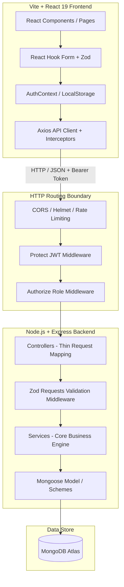
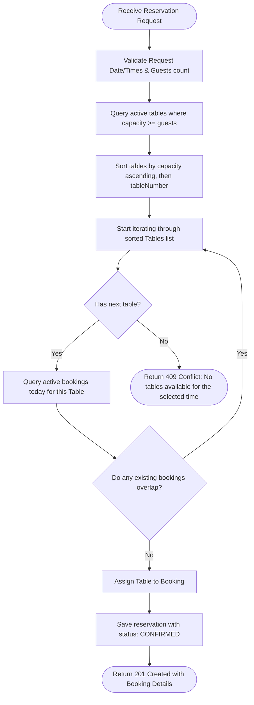

# DineDesk | Restaurant Reservation Management System

DineDesk is a production-quality, high-performance Restaurant Reservation Management System. Built using clean architecture and SOLID principles, this system provides real-time table availability tracking, instant booking confirmations, mathematical double-booking prevention, and comprehensive administration panels.

---

## 1. System Architecture

DineDesk separates concerns into decoupled horizontal layers to ensure maintenance predictability, code reuse, and seamless scaling.

### Architectural Blueprint


---

## 2. Directory Layout Map

```text
dinedesk/
├── backend/
│   ├── src/
│   │   ├── config/        # Mongoose database connector, environment loaders
│   │   ├── constants/     # Response codes, reservation status strings
│   │   ├── controllers/   # Thin routing boundary controllers
│   │   ├── errors/        # Custom ApiError operational exception classes
│   │   ├── middleware/    # Global error handlers, JWT protect, and authorize roles
│   │   ├── models/        # Mongoose schemas: User, Table, Reservation
│   │   ├── routes/        # Router endpoint setups: auth, tables, reservations, admin
│   │   ├── seed/          # ESM database seed script and isolated units test suites
│   │   ├── services/      # Core business logical services: booking allocation engine
│   │   ├── utils/         # Central ApiResponse serializers, asyncHandler wrappers
│   │   ├── validators/    # Zod payload formats check schemas
│   │   ├── app.js         # Express app initialization, parser configs, and security setup
│   │   └── server.js      # Server launch entry point and global process event bindings
│   ├── .env.example       # Backend environmental variables template
│   └── package.json       # Backend dependency manifest
│
├── frontend/
│   ├── src/
│   │   ├── api/           # Custom Axios Client with JWT headers request interceptors
│   │   ├── components/    # Reusable atomic buttons, layouts, panels
│   │   ├── contexts/      # AuthContext session state context
│   │   ├── layouts/       # BaseLayout wrapper containing responsive menus and footer
│   │   ├── pages/         # Screen panels: Landing page, Login, Register, Dashboards
│   │   ├── routes/        # ProtectedRoute, AdminRoute, and central browser history routing
│   │   ├── index.css      # Core Tailwind CSS v4 compiler entry
│   │   └── main.jsx       # Client bootstrapping index
│   ├── index.html         # HTML entry with search optimization tags
│   ├── vite.config.js     # Vite compiler configuration loaded with Tailwind plugin
│   └── package.json       # Frontend dependency manifest
│
├── package.json           # Root workspace config orchestrating parallel server startups
└── README.md              # Project developer guide and documentation
```

---

## 3. Local Installation & Quick Start

### Prerequisites
- [Node.js](https://nodejs.org/) (v18.x or higher)
- [MongoDB](https://www.mongodb.com/try/download/community) running locally or a [MongoDB Atlas](https://www.mongodb.com/cloud/atlas) connection string.

### Setup Instructions
1.  **Clone the repository**:
    ```bash
    git clone https://github.com/Nadirsha-Syed/dinedesk.git
    cd dinedesk
    ```
2.  **Install dependencies**:
    Install packages across workspace root, backend, and frontend folders:
    ```bash
    npm run install:all
    ```
3.  **Configure environment variables**:
    Configure environment files (refer to Section 4 below).
4.  **Run Database Seeder**:
    Populate database collections with initial tables and default credentials:
    ```bash
    npm run seed --prefix backend
    ```
5.  **Launch Local Development Servers**:
    Start the Express backend and Vite React frontend concurrently:
    ```bash
    npm run dev
    ```
    - Express server starts on: `http://localhost:5000`
    - Vite React dashboard starts on: `http://localhost:5173`

---

## 4. Environment Variables Schema

### Backend Configurations (`/backend/.env`)
| Variable | Description | Default / Example |
| :--- | :--- | :--- |
| `PORT` | Local HTTP port for the Express service | `5000` |
| `MONGODB_URI` | Connection URI for local MongoDB or Atlas cloud instance | `mongodb://localhost:27017/dinedesk` |
| `JWT_SECRET` | Secret key used to sign JWT authentication tokens | `super_secret_jwt_key_change_in_production` |
| `JWT_EXPIRES_IN` | Session token lifespan duration | `1d` |
| `NODE_ENV` | Running runtime state environment selector | `development` |
| `CORS_ORIGIN` | Allowed domains for CORS policies | `http://localhost:5173` |

### Frontend Configurations (`/frontend/.env`)
| Variable | Description | Default / Example |
| :--- | :--- | :--- |
| `VITE_API_URL` | Base endpoint URL pointing to the active Backend service | `http://localhost:5000` |

---

## 5. API Endpoints Reference

All requests and response payloads communicate using standard JSON formats.

### Authentication Endpoints (`/api/v1/auth`)
- **`POST /register`**: Register a new customer user.
  - **Payload**: `{ "name": "Jane Doe", "email": "jane@example.com", "password": "password123" }`
  - **Response (201)**: `{ "success": true, "statusCode": 201, "message": "...", "data": { "user": { "id": "...", "name": "Jane Doe", "email": "jane@example.com", "role": "customer" }, "token": "JWT_TOKEN" } }`
- **`POST /login`**: Sign in existing credentials.
  - **Payload**: `{ "email": "jane@example.com", "password": "password123" }`
  - **Response (200)**: returns profile fields and session token.
- **`GET /me`**: Retrieve current session details.
  - **Headers**: `Authorization: Bearer <token>`
  - **Response (200)**: `{ "success": true, "statusCode": 200, "data": { "id": "...", "name": "Jane", "email": "...", "role": "customer" } }`

### Table Management Endpoints (`/api/v1/tables`)
- **`GET /`**: Retrieve dining tables list. (Supports filter: `?isActive=true`).
  - **Headers**: `Authorization: Bearer <token>`
- **`POST /`**: Create a new dining table. [Admin Only]
  - **Headers**: `Authorization: Bearer <token>`
  - **Payload**: `{ "tableNumber": 16, "capacity": 4 }`
  - **Response (201)**: `{ "success": true, "statusCode": 201, "data": { "tableNumber": 16, "capacity": 4, "isActive": true } }`
- **`DELETE /:id`**: Delete a table. [Admin Only] (Fails if table has future reservations).

### Booking Reservations Endpoints (`/api/v1/reservations`)
- **`POST /`**: Create a reservation. Instantly allocates table.
  - **Headers**: `Authorization: Bearer <token>`
  - **Payload**: `{ "reservationDate": "2026-10-15", "startTime": "18:00", "endTime": "19:30", "numberOfGuests": 3 }`
  - **Response (201)**: Returns the booking record linked to allocated table.
  - **Response (409)**: If fully booked: `{ "success": false, "statusCode": 409, "message": "No tables available for the selected time." }`
- **`GET /upcoming`**: Retrieve customer's active upcoming reservations.
- **`GET /past`**: Retrieve customer's reservation history.
- **`PATCH /:id/cancel`**: Cancel a customer booking.

### Administration Overrides (`/api/v1/admin`)
- **`GET /stats`**: Real-time stats widgets and occupancy rates. [Admin Only]
  - **Response (200)**: `{ "success": true, "data": { "todayReservations": 3, "upcomingReservations": 12, "cancelledReservations": 2, "totalCustomers": 5, "totalTables": 15, "occupancyPercentage": 20.00 } }`
- **`GET /reservations`**: Paginated, searchable system-wide reservation tracker. [Admin Only]
  - **Parameters**: `?page=1&limit=8&search=john&status=CONFIRMED&date=2026-10-15`
- **`PUT /reservations/:id`**: Force override reservation details (dates, times, guests, or tables). [Admin Only]
- **`PATCH /reservations/:id/cancel`**: Force cancel any active booking. [Admin Only]

---

## 6. Booking Search & Conflict Detection Engine

The system uses a mathematical search-and-sort engine to select the best dining tables.

### Engine Logic Flowchart


### Overlap Check Equation
Two reservation windows overlap if and only if:
$$\text{Existing.startTime} < \text{Requested.endTime} \quad \text{AND} \quad \text{Existing.endTime} > \text{Requested.startTime}$$

This handles all conflict variants:
- Overlapping at the start boundary.
- Overlapping at the end boundary.
- Nested start and end windows.
- Back-to-back reservations (e.g. `18:00 - 19:00` and `19:00 - 20:00`) are successfully allowed as they only touch boundaries and do not overlap.

---

## 7. Role-Based Access Control (RBAC)

Authorization privileges are divided into two distinct roles:

- **Customer**:
  - Register, Login, and read own profile.
  - Create reservations (invokes auto-allocation engine).
  - View own upcoming reservations and past history.
  - Cancel own upcoming reservations (restricted to future date bookings).
- **Admin**:
  - View real-time stats cards (today's bookings, cancellations, customer totals, and occupancy rates).
  - Search, filter, and paginate reservations across all customer accounts.
  - Force cancel any booking.
  - Force update/edit booking details (dates, guests, table switches).
  - CRUD restaurant dining tables (add new tables, delete configurations).

---

## 8. Deployment Guide

### Database: MongoDB Atlas Setup
1.  Sign in to [MongoDB Atlas](https://www.mongodb.com/cloud/atlas) and spin up a free M0 Shared Cluster.
2.  In **Network Access**, whitelist connection requests (add IP `0.0.0.0/0` to allow Render/Vercel dynos access).
3.  In **Database Access**, create a user profile with `Read and Write to any database` permissions.
4.  Copy the connection string URL (replacing placeholders with username/password) to use as the `MONGODB_URI`.

### Backend: Render Deployment
1.  Sign in to [Render](https://render.com/) and create a new **Web Service**, linking your GitHub repository.
2.  Configure project settings:
    - **Root Directory**: `backend` (or root with command overrides)
    - **Runtime**: `Node`
    - **Build Command**: `npm install`
    - **Start Command**: `node src/server.js`
3.  Add environmental variables in the **Environment** tab:
    - `PORT`: `10000` (Render default)
    - `MONGODB_URI`: *Your Atlas URI string*
    - `JWT_SECRET`: *A secure random string*
    - `JWT_EXPIRES_IN`: `1d`
    - `NODE_ENV`: `production`
    - `CORS_ORIGIN`: *Your Vercel deployment URL*

### Frontend: Vercel Deployment
1.  Sign in to [Vercel](https://vercel.com/) and import your project repository.
2.  Configure project settings:
    - **Framework Preset**: `Vite`
    - **Root Directory**: `frontend`
3.  Add environment variables:
    - `VITE_API_URL`: *Your Render backend URL (e.g. https://dinedesk-api.onrender.com)*
4.  Click **Deploy**. Vercel will build and serve your static React application.

---

## 9. Assumptions, Limitations, and Roadmap

### Engineering Assumptions
- **Non-Combinable Seating**: Tables are physical entities. The allocation engine cannot automatically combine two 2-person tables to serve a booking request for 4 guests.
- **Normalized Dates**: Dates are processed at the UTC calendar day level. Hour, minute, and second variations are stripped on write to simplify date logic.
- **Fixed Seating Windows**: Seating slots are configured between `11:00` and `22:00` in 30-minute intervals.

### Current Limitations
- **No Hold Lock**: Under high concurrent traffic, two check requests might see a table as available simultaneously. The first request to save in MongoDB will lock the table, while the second will return a conflict error.
- **No Table Swapping**: Customers cannot edit booking dates or swap tables themselves. Booking overrides must be requested through system administrators.

### Future Scalability Roadmap
1.  **Table Combining Heuristic**: Upgrade the allocation engine to evaluate adjacent table numbers and combine table groupings to seat larger parties.
2.  **Distributed Hold Locks**: Add Redis-based distributed locking to lock tables for 5 minutes during the checkout phase, preventing booking races.
3.  **Real-Time Subscriptions**: Integrate WebSockets (Socket.io) to push real-time table configurations, bookings, and occupancy stats updates to admin dashboards.

---

## 10. Emulated Postman Collection

Create a Postman environment with the variable `base_url` pointing to `http://localhost:5000/api/v1` (or your Render URL) and use the following template to populate requests:

```json
{
  "info": {
    "name": "DineDesk REST API Collection",
    "schema": "https://schema.getpostman.com/json/collection/v2.1.0/collection.json"
  },
  "item": [
    {
      "name": "Auth: Register Customer",
      "request": {
        "method": "POST",
        "header": [],
        "body": {
          "mode": "raw",
          "raw": "{\n  \"name\": \"John Doe\",\n  \"email\": \"john@dinedesk.com\",\n  \"password\": \"customerPassword123\"\n}",
          "options": { "raw": { "language": "json" } }
        },
        "url": { "raw": "{{base_url}}/auth/register" }
      }
    },
    {
      "name": "Auth: Login Customer",
      "request": {
        "method": "POST",
        "header": [],
        "body": {
          "mode": "raw",
          "raw": "{\n  \"email\": \"john@dinedesk.com\",\n  \"password\": \"customerPassword123\"\n}",
          "options": { "raw": { "language": "json" } }
        },
        "url": { "raw": "{{base_url}}/auth/login" }
      }
    },
    {
      "name": "Bookings: Create Reservation",
      "request": {
        "method": "POST",
        "header": [
          { "key": "Authorization", "value": "Bearer {{jwt_token}}", "type": "text" }
        ],
        "body": {
          "mode": "raw",
          "raw": "{\n  \"reservationDate\": \"2026-10-15\",\n  \"startTime\": \"18:00\",\n  \"endTime\": \"19:30\",\n  \"numberOfGuests\": 3\n}",
          "options": { "raw": { "language": "json" } }
        },
        "url": { "raw": "{{base_url}}/reservations" }
      }
    }
  ]
}
```
